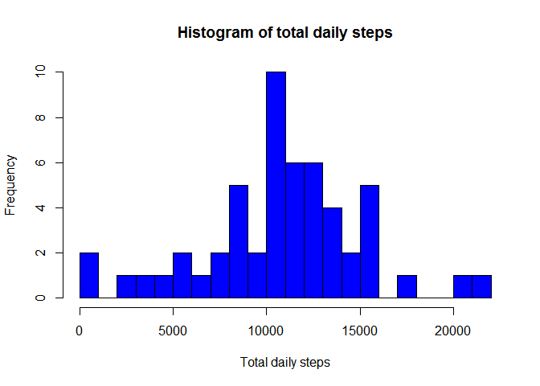
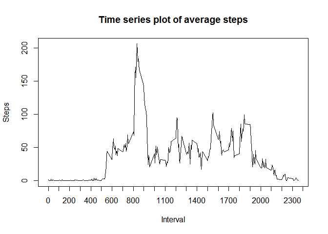
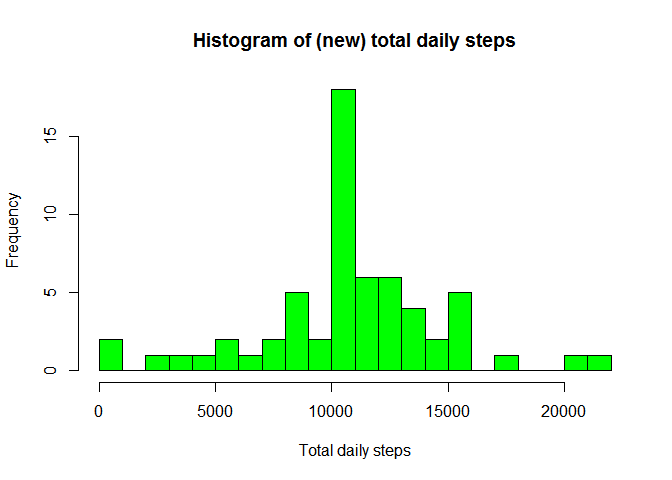
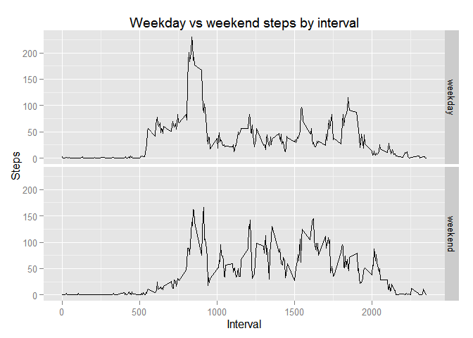

# Reproducible Research: Peer Assessment 1


## Loading and preprocessing the data
Read in the data from the (CSV file in the) zip file.
Convert date data to date class:

```r
data <- read.table(unzip("activity.zip"), header=TRUE, sep = ",", as.is=TRUE)
data$date <- as.POSIXlt(data$date)
```

## What is mean total number of steps taken per day?
Calculate the total daily steps and plot a histogram of these totals:

```r
library(plyr)
```

```
## Warning: package 'plyr' was built under R version 3.1.3
```

```r
daily_total <- ddply(data, .(date), summarize, total = sum(steps))

hist(daily_total$total, 
     breaks=25, 
     col="blue", 
     main="Histogram of total daily steps", 
     xlab="Total daily steps")
```

 

Calculate and report the mean and median of the total number of steps taken per 
day:

```r
TDSmean <- mean(daily_total$total, na.rm=TRUE)
TDSmedian <- median(daily_total$total, na.rm=TRUE)
```
The mean of total daily steps is 1.0766189\times 10^{4}, and the median is 10765.

## What is the average daily activity pattern?
Calculate the average daily steps per time interval and plot as a time series:

```r
daily_average <- ddply(data, .(interval), summarize, 
                       average=mean(steps, na.rm=TRUE))

plot(daily_average, type="l", 
    main="Time series plot of average steps", 
    xlab="Interval", 
    xaxp=c(0,2400,24),  # specify 24 tick marks on x-axis for 24 hours of day
    ylab="Steps")
```

 

Calculate the 5-minute interval which, on average across all the days in the 
dataset, contains the maximum number of steps:

```r
daily_average[which.max(daily_average$average),1]
```

```
## [1] 835
```

## Imputing missing values
Calculate and report the total number of missing values in the dataset (i.e. the total number of rows with NAs):

```r
sum(is.na(data$steps))
```

```
## [1] 2304
```

Devise a strategy for filling in all of the missing values in the dataset: 
use the mean for that 5-minute interval.

Create a new dataset that is equal to the original dataset but with the missing 
data filled in:

```r
newdata <- data
for(i in 1:nrow(data)){
    if(is.na(data[i,1])){
        intLookup <- which(daily_average$interval==data[i,3])
        newdata[i,1] <- daily_average[intLookup,2]
    } 
}
```

Make a histogram of the total number of steps taken each day and Calculate and report the mean and median total number of steps taken per day:

```r
library(plyr)
new_daily_total <- ddply(newdata, .(date), summarize, total = sum(steps))

hist(new_daily_total$total, 
     breaks=25, 
     col="green", 
     main="Histogram of (new) total daily steps", 
     xlab="Total daily steps")
```

 

```r
nTDSmean <- mean(new_daily_total$total)
nTDSmedian <- median(new_daily_total$total)
```
The mean of new total daily steps is 1.0766189\times 10^{4}, and the median is 
10765.

Do these values differ from the estimates from the first part of the assignment?

```r
meanDiff <- nTDSmean - TDSmean
medDiff <- nTDSmedian - TDSmedian
```
The difference in mean estimates is 0, and the difference in median
estimates is 1.1886792.

What is the impact of imputing missing data on the estimates of the total daily number of steps?

```r
daily_total_diff <- daily_total
names(daily_total_diff) <- c("date", "difference")
for(i in 1:nrow(daily_total)){
    if(is.na(daily_total[i,2])){
        daily_total_diff[i,2] <- new_daily_total[i,2]
    } else {
        daily_total_diff[i,2] <- new_daily_total[i,2] - daily_total[i,2]
    }
}
```
The original daily totals had the following dates with NAs:

```r
daily_total[is.na(daily_total$total),]
```

```
##          date total
## 1  2012-10-01    NA
## 8  2012-10-08    NA
## 32 2012-11-01    NA
## 35 2012-11-04    NA
## 40 2012-11-09    NA
## 41 2012-11-10    NA
## 45 2012-11-14    NA
## 61 2012-11-30    NA
```
The new daily totals made a difference to the original daily totals on the following dates:

```r
daily_total_diff[daily_total_diff$difference > 0,]
```

```
##          date difference
## 1  2012-10-01   10766.19
## 8  2012-10-08   10766.19
## 32 2012-11-01   10766.19
## 35 2012-11-04   10766.19
## 40 2012-11-09   10766.19
## 41 2012-11-10   10766.19
## 45 2012-11-14   10766.19
## 61 2012-11-30   10766.19
```
The impact of the chosen method of imputing missing data on the estimates of the total number of daily steps is:

* no difference in the mean - this is because the chosen method imputes the mean values to missing data, therefore the overall mean does not change.
* a small difference in the median - this is because missing values have been replaced by (positive) values, therefore the overall median will show an increase.

## Are there differences in activity patterns between weekdays and weekends?
Create a new column to label dates as either weekday or weekend, and calculate new averages by interval and day type:

```r
day_type <- weekdays(newdata$date)
for(i in 1:NROW(day_type)){
    if(day_type[i] == "Saturday" || day_type[i] == "Sunday") {
        day_type[i] <- "weekend"
    } else {
        day_type[i] <- "weekday"
    }
}
newdata$day_type <- day_type
new_daily_average <- ddply(newdata, .(interval, day_type), summarize, 
                       average=mean(steps))
```

The differences in activity patterns between weekdays and weekends can be seen in the following plot:

```r
library(ggplot2)
```

```
## Warning: package 'ggplot2' was built under R version 3.1.3
```

```r
qplot(interval, average, data=new_daily_average, 
      geom = "line", 
      facets = day_type~.,
      xlab = "Interval",
      ylab = "Steps",
      main = "Weekday vs weekend steps by interval"
)
```

 
